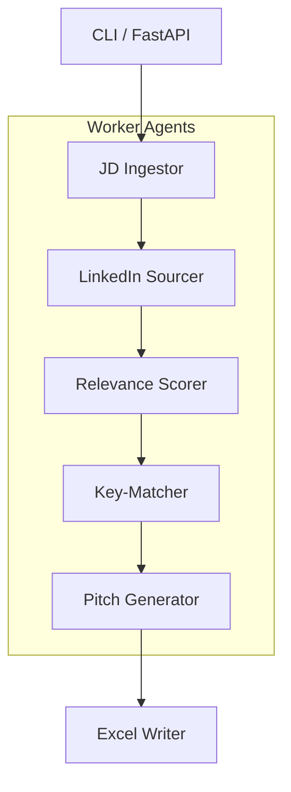

# 🧙‍♀️ Sourceress – Your Agentic Recruiting Assistant

[](https://www.python.org) 
[](LICENSE)

As I embarked on my learning journey into agentic AI—and still couldn't conjure a "killer" use-case beyond yet another summariser—I took the pragmatic route: grilled my girlfriend, a battle-hardened talent-acquisition specialist, about her daily grind and set out to automate every tedious bit. The result is **Sourceress**.

Sourceress is a fully-automated workflow that replicates (and hopefully
speeds-up) the end-to-end process of sourcing creative talent:

1. **Ingest Job Description** – parse free-text into structured data.
2. **Source on LinkedIn** – scrape ≥ 50 profiles, keep the top 10.
3. **Relevance Scoring** – score each candidate 0-100 with feature weights.
4. **Key-Match Extraction** – highlight bullet-level matches between JD & CV.
5. **Pitch Generation** – craft a cold-call script, LinkedIn DM & WhatsApp msg.
6. **Excel Output** – write everything to a nicely-formatted workbook.

The goal is not to replace recruiters but to remove their dullest chores so
they can focus on the *human* bit – persuasion and relationship-building.

---

## ⚙️ Tech Stack

• Python 3.11  ·  CrewAI  ·  LangChain + OpenAI o3  ·  Playwright  ·  Pandas / OpenPyXL  ·  FastAPI (optional)  ·  pytest   
• Tooling: loguru, pre-commit (ruff, black, isort, mypy)

-   
-   
-  +   
-   
-  /   
-  *(optional)*  
- 

**Tooling**

- 
-  *(ruff, black, isort, mypy)*

---

## 🧩 Architecture

The full sequence & data-flow diagram lives in [`docs/architecture.mermaid`](docs/architecture.mermaid).
At a glance:



---

## 🚀 Quick-Start

```bash
# 1️⃣ Clone & install deps
$ git clone https://github.com/your-org/sourceress.git
$ cd sourceress
$ python -m venv .venv && source .venv/bin/activate
$ pip install -e .[dev]    # uses pyproject.toml extras

# 2️⃣ Install Playwright browsers (once)
$ playwright install chromium

# 3️⃣ Export required env vars
$ export OPENAI_API_KEY=...
$ export LINKEDIN_COOKIE=...     # see docs for how to grab yours

# 4️⃣ Run the main workflow against a JD file
$ python -m sourceress "docs/example_jd.txt"
```

### Available CLI flags

```bash
--jd TEXT         Path or raw text of the job description
--out DIR         Output directory (default: ./output)
--top INT         Number of final candidates to keep (default: 10)
--headless/--no-headless   Playwright browser mode (default: headless)
```

---

## 🗂️ Project Layout

```text
sourceress/
├── src/
│   ├── agents/                # autonomous workers
│   │   ├── jd_ingestor.py
│   │   ├── linkedin_sourcer.py
│   │   ├── relevance_scorer.py
│   │   ├── key_matcher.py
│   │   ├── pitch_generator.py
│   │   └── excel_writer.py
│   ├── workflows.py           # Crew definitions
│   ├── models.py              # Pydantic models
│   ├── utils/                 # helpers (scraping, logging, …)
│   └── main.py                # CLI entry-point
├── tests/                     # pytest suite
├── docs/                      # architecture, prompts, etc.
└── pyproject.toml
```

---

## 🧪 Tests

```bash
pytest -q     # unit tests (integration tests pending)
```

---

## 🤝 Contributing

1. Fork & create a feature branch.
2. Run `pre-commit install` and ensure *ruff*, *black*, *isort* & *mypy* pass.
3. Add/extend tests where relevant.
4. Open a pull request – all checks *must* be green.

---

## 🛣️ Roadmap

- [ ] FastAPI wrapper for an HTTP interface
- [ ] Better résumé parsing (PDF → structured JSON)
- [ ] Semantic caching of LLM calls
- [ ] Automated unit/integration test mocks for Playwright & OpenAI

---

## 📝 Licence

MIT © Sanchit Verma– happy hiring!
